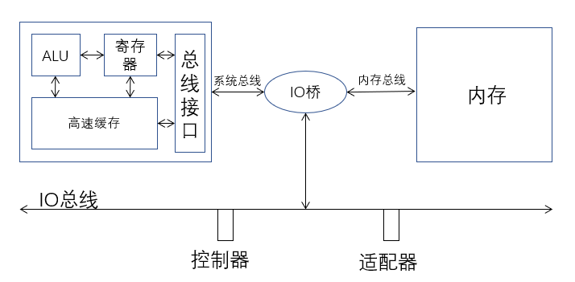
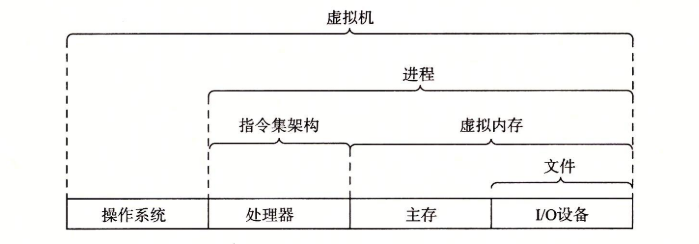
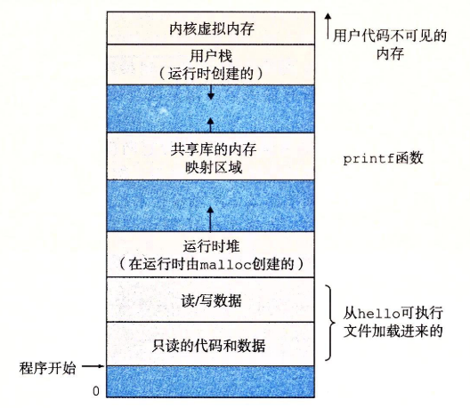

# 1. 计算机中的信息
- 计算机系统由硬件和软件系统组成
- 比特位: 0/1, 字节: 8个比特位
- 不同的数据对象: 比特位 + 上下文

# 2. 编译系统
- 源程序(.c) 经过 预处理器(cpp c_preprocessor) -> 
- 预处理后源代码(.i) 经过 编译器(ccl c_compiler) -> 
- 汇编代码(.s)  经过汇编器(as assembler) -> 
- 可重定向目标程序(.o) 经过连接器(ld linker) -> 
- 执行文件(.exe) 

# 3. 系统的硬件组成
## 3.1 总体结构
- 总线: 贯穿系统的电子管道, 传送字, 字长不尽相同, 常见有 4/8 字节
- I/O 设备: 通过 适配器(可插拔的卡) 或 控制器(焊接在主板上的电路) 与 I/O 总线相连
- 主存: DRAM 芯片组, 逻辑上等效为线性字节数组
- 处理器: 由控制单元(CU), 算术逻辑单元(ALU), 寄存器(含PC)组成, 解释并执行存储在主存上的指令

## 3.2 处理器操作
- 处理器大致操作可分为:
  - 加载: 主存 -> 寄存器
  - 存储: 寄存器 -> 主存
  - 操作: 主存 -> 寄存器 -> ALU操作 -> 寄存器 
  - 跳转: 主存 -> 寄存器 -> ALU提取地址 -> PC
## 3.3 指令集架构和微体系结构
- 指令集架构: 描述机器指令的格式和功能
- 微体系结构: 描述处理器和指令的具体实现

# 4. print-hello 程序数据流
- 输入`./hello`:
  - 命令 从 键盘适配器 -> 寄存器
  - 命令 从 寄存器 -> 内存
- 回车:
  - 目标程序 从 磁盘控制器 -> 内存
- 执行: 
  - 目标程序 从 内存 -> PC
  - 字符串 从 寄存器 -> 显示屏

# 5. 存储层次
- 寄存器 : 与 CPU 处理速度一致
- L1 高速缓存 : SRAM 实现, 与寄存器相仿
- L2 高速缓存 : SRAM 实现, 慢 5 倍左右 (比寄存器)
- 主存 : DRAM 实现, 慢 25 - 50 倍左右 (比寄存器)
- 磁盘和远程磁盘 : 慢 1000 万倍 (比内存)

# 6. 操作系统
- 定义: 位于硬件和应用程序之间的软硬结合层
- 基本功能: 对硬件抽象 和 防止硬件被软件滥用
- 操作系统内核 : 操作系统代码常驻内存的部分, 不是进程而是管理全部进程的所有代码和数据结构的集合

## 6.1 进程抽象
- 进程定义: OS 对 并发运行程序的抽象, 使得每个程序好像都在独占使用所有硬件
- 基本功能: 提供进程或线程的并发运行功能 和 进程的上下文切换的功能
- 并发运行: 系统上一段时间内可以运行多个程序, 每个程序的执行顺序是交错的
- 线程定义: 对进程单一控制流多个可并发执行部分的抽象, 即单一控制流分成多个执行单元, 运行在同一的上下文中, 共享同样的代码和全局数据
- 上下文切换流程: 进程A运行, 调用系统调用, 控制权转移给内核, 内核保存A进程上下文然后更新B进程上下文, 将控制权转移给进程B, B进程运行
## 6.2 虚拟内存抽象
- 虚拟内存 : OS 对 主存和IO设备的抽象,使得每个程序好像都在独占使用所有内存, 且每个内存的结构都一致
- Linux中的虚拟地址空间

## 6.3 文件抽象
- 文件: OS 对 IO设备的抽象, 实质是字节序列
- 通过 OS 规定的函数来统一读写不同的IO设备, 底层的操作由驱动完成

# 7. 重要概念
## 7.1 阿姆达定律
- 意义 : 对一个系统某部分提升的而对整体产生的效果取决于该部分的重要性和提升程度
- Tn = To(1 - a)  + a \* To / k = To \* (1 - a + a / k)
- S = 1 / (1 - a + a / k)

## 7.2 并发和并行
- 一般意义
  - 并发: 同一时间段多个事发生
  - 并行: 同一时间多个事正在发生
- 书中意义
  - 并发: 同一时间有多个活动的系统
  - 并行: 使用并发加速系统运行的手段
- 单核和多核
  - 单核: 通过多任务分时切换模拟进程并发
  - 多核: 集成多个 CPU核 独占一组硬件共享一组硬件 (比如独占 L1 共享 L2) 真正实现并发
  - 超线程:在多核的基础上切换线程模拟并发
- 指令级并行
  - 流水线: 划分步骤后组合各个阶段, 将多个周期执行 1 条指令 降至为 1 个周期执行 1 条指令
  - 超标量: 1 个周期执行多条指令
- 单指令多数据并行, SIMD, 单指令产生多个执行操作