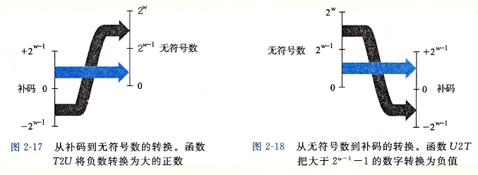
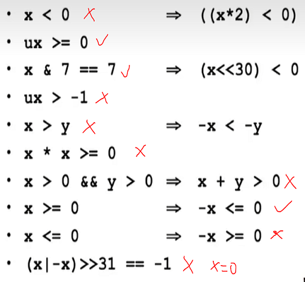

# 1 信息存储
## 1.1 虚拟内存
- 虚拟内存: OS 对 内存, 磁盘存储设备的抽象, 提供机器级程序概念上统一的字节数组的映像
- 虚拟地址空间: 虚拟内存以字节为存储单元的寻址范围, 机器字长可以表示所有虚拟内存的地址, 通常为 32/64 位
- 程序对象: 即存储程序, 由程序数据, 指令, 控制信息等构成, 占据不同的虚拟地址空间, 由 OS 内存管理

## 1.2 十六进制表示法
- 只需记忆 1100C12, 1101D13, 1111=2^4-1, 10000=2^4 
- 2^n->hex 转换: n = i + 4j, 如 2^33 = 0x2_0000_0000
- 十进制转换为十六进制: 反复求余, 结果倒序
- KB(10), MB, GB, TB PB, EB

## 1.3 大小端
- 数小端法: 从最低到最高有效位, 按地址从低到高排序(Intel, IOS)
- 数大端法: 从最高到最底有效位, 按地址从低到高排序(Oracle, IBM)
- 字符串: `\0` 结尾, 按字符顺序存储 (show_bytes.cc, little_endian.cc)

## 1.4 布尔代数
- 位向量: 用 w 位表示集合中每个元素是否存在
- 布尔运算: `|`, `&` 和 `~` 运算, 其中 `&` 与 `|` 互相存在分配律
- 布尔环: `^`, `&` 和 `~` 运算, `^` 自身为加法逆元 (inplace_swap.cc)

|     | 0    | 1    |
|-----|------|------|
| AND | 0    | save |
| OR  | save | 1    |
| XOR | save | ~    |

- bis(x, y ) == x or y 
- bic(x, y) == x & ~y 
- x ^ y == (x & ~y) | (~x & y)

## 1.5 移位运算
- 左移补零, 算术右移补符号位, 逻辑右移补零
- 部分情况下, 位移 k = k mod w 换句话说, k 一定小于位长

# 2 整数表示
## 2.1 双射编码
- 无符号数 : B2Uw
- 补码(Two's complement): B2Tw 不对称, T_max+1=|T_min| 是一个 corner case, 10000-x
- 原码(Sign-Magnitude):   B2Sw 对称双零
- 反码(Ones' complement): B2Ow 对称双零, 1111-x
- 具体范围见(show_range.cc)

## 2.2 有符号和无符号转换
- T2Uw: 负数->加两倍最高位权 
- U2Tw: 超过Tmax->减去两倍最高位权
- 同类型有符与无符号数相运算优先转换成无符号

## 2.3 扩展与截断
- 无符号扩展 加零, 有符号扩展 加符号位
- C 语言规则 规定 小整型运算时会先整型提升, 然后进行有符号和无符号转换
- 无符号截断为k位 : x mod 2^k
- 有符号截断为k为 : U2T( T2U mod 2^k ), 若负截断为正则 +2^k(特殊的模)

# 3 整数运算
## 3.1 无符号加法
- x+y = x+y (没溢出)
- x+y = x+y-2^w ( 溢出 )
- 模数加法构成阿贝尔群, 存在加法逆元 -x = 2^w-x (0 的加法逆元是自己)

## 3.2 补码加法
- 与无符号加法有相同的位级表示, 以此可推出, 分四种情况, 用到模运算性质
  - x+y=x+y-2^w (正溢出)
  - x+y=x+y (没溢出)
  - x+y=x+y+2^w (负溢出)
- 求补码加法逆元的三种方法
  - 求反码最后一位+1 
  - 求反直到遇到最后一个1为止(1保留)
  - 1000000 - x 
  - 特殊情况-TMIN=TMIN 

## 3.3 无符号和补码乘法
- 无符号乘法 x\*y = x\*y mod2^w
- 补码乘法 x\*y = U2T((x\*y) mod 2^w)
- 补码乘法位级等价性证明
- 加法, 减法, 乘法溢出判断见 (operation_ok.cc)

## 3.4 乘除常数
- 无符号数与补码 乘以 2^k 等价 左移k位
- 乘以常数K(0111110) 有两种转换方法:  
  - 位权相加: K=2^k1 + 2^k2 +...+ 2^kn 
  - 连续1转换为两个位权相减: K=2^6 - 2^1
- 数学中整数除法向零取整(正数向下取整, 负数向上取整)
- 无符号数 除以 2^k 等价 右移k位, 向下取整
- 补码 除以 2^k 等价 右移k位:
  - 正数向下取整
  - 负数也向下取整, 需要调整
- 上取整与下取整转换:
  - $$\lceil x/y \rceil = \lfloor (x+y-1)/y \rfloor$$
  - $$\lfloor x/y \rfloor = \lceil (x-y+1)/y \rceil$$
- 偏置法: 每次右移位, 舍掉1则末位+1, 舍掉0则末位+0
- 公式法: (x+(1<<k)-1)>>k (x< 0) 见 (int_div.cc)

## 3.5 其他
- -m32, -m64 为gcc 编译位数选项
- 实际用到的内存位数并非64而是47
- 机器字长/字不是统一的定义, 但一般指ALU常用整型加法的位数或指针大小, word = n bytes

# 4 浮点数
## 4.1 IEEE 浮点表示
- 近似表示, 精度有限, 不可结合
- 表示方式 : V = (-1)^s \* 2^E \* M 分别为 符号, 阶码和尾数
- 分布 : 1+8+23 / 1+11+52 
- 三种特殊浮点 : 
    - 规格化的 : 不为0, 不为255
    - 非规格化的 : E 都为 0
    - 特殊情况 : E 都为 1
      - M 为 0 , 根据 s 分为 正无穷和负无穷
      - M 为 非0, NaN

## 4.2 阶码部分
| 阶码位数 | 阶码作为无符号数范围 | bias : 2^(k-1) - 1 | 阶码实际范围       |
|------|------------|--------------------|--------------|
| 8    | 1 ~ 254    | 127                | -126 ~ 127   |
| 11   | 1 ~ 2046   | 1023               | -1023 ~ 1024 |

> 非规格化数 阶码为 1 - bias 而非 0 - bias,  实现非规格化数的平滑过度
> 非规格化数提供逐渐溢出, 均匀分布在 0 的两端

## 尾数部分
- 规格化数, 有隐藏的 1 , 如 10010101 实际为 1.10010101
- 非规格化数, 没有隐藏的 1, 如 10010101 实际为 0.10010101

## 舍入
- 舍入类型 : 
    - 向上舍入
    - 向下舍入 
    - 向零舍入 
    - 向偶数舍入 (减小误差 )
- 十进制小数的舍入只有在正中央时参照最后一位是否为偶数进行舍入
- 二进制小数的舍入只有在正中央时参照最后一位是否为零进行舍入

## 浮点运算
- 每一步骤可看作 Round(x ◦ y), 没有可结合性, 编译器倾向于优化保守
- 满足单调性及不等式性质, 具有交换性
- 除以零会产生无穷, NAN + x  = NAN, 无穷 ◦ 无穷 = NAN

## C语言浮点数转换
- 整型转浮点存在舍入
- double 转 float 存在 舍入 或 溢出为无穷
- 浮点数 转 int 存在合适值则向零舍入, 如果超出范围则会指定为 [1000...0]w 的位模式 
- 浮点数 转 unsigned 与 转 int 不一样需要具体看

# 2.5 习题
2.35 判断补码相乘溢出的实质  
`x * y = t * 2 ^ w + p => p = x * y - t * 2 ^ w`
2.36 `~ x = -x -1` ( x 是有符号数)
2.46 十进制小数 转 二进制小数, 循环替换
2.49 23 位尾数从1开始连续增加的最大正整数为 1.0000000 1 \* 2^24 = 2^24 + 1

