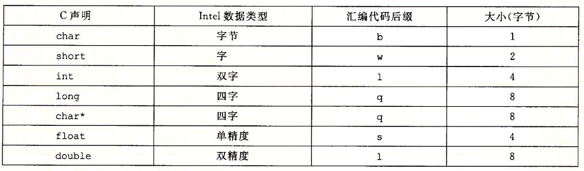
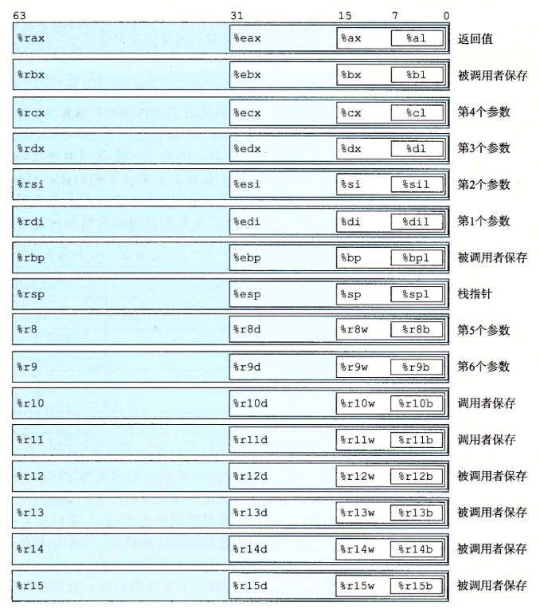
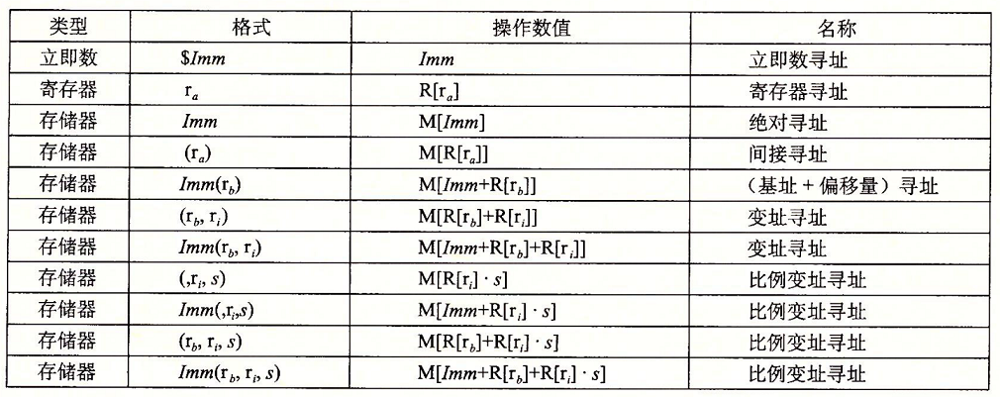
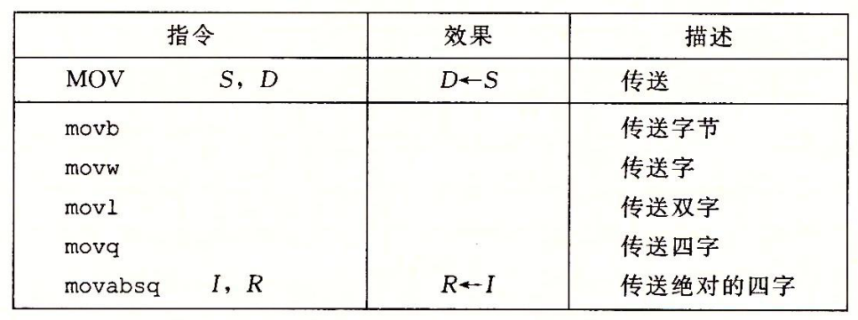
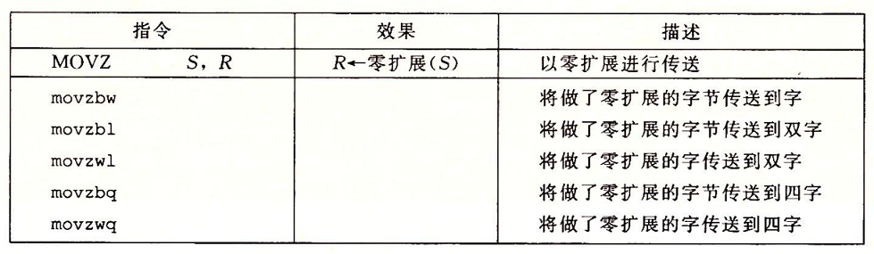
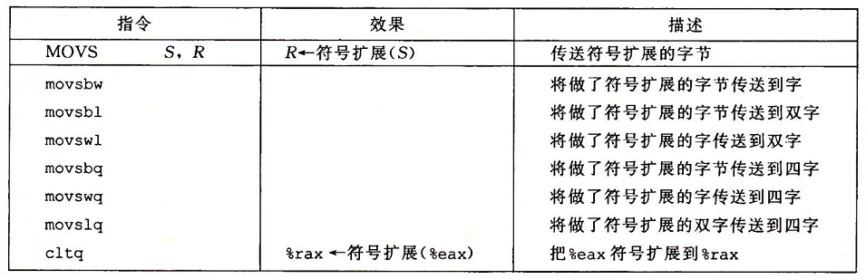
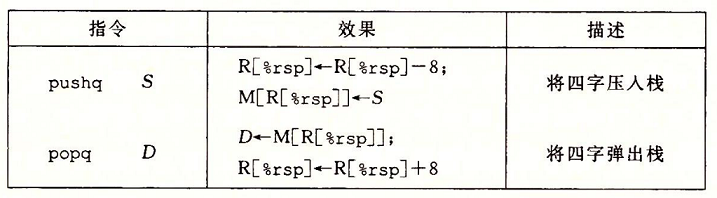
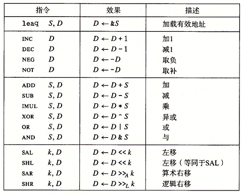

# 1 背景概要
## 1.1 历史
- x86-64 是 CISC 指令集架构普遍用于PC, ARM 是 RISC 指令集架构普遍用于智能手机
- x86-64(amd64) 开始于 1978 年 Intel 公司的第一个 16 位处理器 8086
- 摩尔定律: 18个月单位面积上集成的晶体管数量翻倍

## 1.2 基础命令
- gcc 命令选项
  - `-S` 生成汇编
  - `-O1/-O2` 表示不同优化等级
  - `-masm=intel` 使用 intel 格式
- `objdump -d exe_name > exe.s` 反汇编, AT&T 格式
- `(gdb) x/14xb foo` foo的地址开始 打印(x/) 14个十六进制的字节(14xb)

## 1.2 寄存器
- PC(Program Counter): %rip 存放下一条指令地址
- PSW(Program Status Word): 保存算术或逻辑指令状态信息, 保存控制流信息
- 16个通用寄存器: 存放整数或地址, 参数, 局部变量和返回值
- 向量寄存器: 保存多个整数 或 浮点数

# 2 数据格式与寄存器
## 2.1 数据格式
- Intel 规定 word=2byte, long words=4byte, quad words=8byte



## 2.2 通用寄存器
- 两类寄存器命名规则
  - Xl-X-eX-rX
  - rNb-rNw-rNd-rN



## 2.3 三个 x86-64 下通用规则
- 产生 16 位 或 8 位 结果, 不对高位进行任何修正
- 产生 32 位结果, 将高 32 位置零 
- 16 位 或 8 位 寄存器在用于地址计算时或符号扩展为64位 如 `jmp *(ax)`
> 高 32 位置零解决寄存器依赖问题, 方便寄存器重命名解决并发执行问题

# 3 操作数指示符
- 立即数如: $0X123
- 寄存器如: %rax
- 内存引用如: ($0X123)
- 多种寻址操作, 比例因子s = (1,2,4,8) 
- 基址和变址寄存器是64位



# 4 MOV 指令
## 4.1 简单类
- MOV 类指令两个操作数不能都指向内存, 一共有 9-3-1=5 种
- movq 如果源是立即数, 只能为32位补码然后符号扩充到高位, 一般用 movabsq



## 4.2 零和符号拓展
- 源可以是内存和寄存器, 目标必须是寄存器
- movzlq 被 movl 取代, 某些生成双字可取代生成四字命令, 如: movzbq => movzbl 
- 涉及大小和符号的转换: 先原符号改变大小, 后转换符号类型





## 5 压栈弹栈
- 栈底在高位, %rsp 指向栈顶顶端(低位), 先减地址后赋值
- 可以通过 %rsp + n * 8 读取栈内任意元素



# 6 算术与逻辑运算



- leaq, 加载有效地址, 目标必须是寄存器, 一般作用于加法和优化乘法
- 一元二元, 移位和逻辑操作都有 b, w, l, q 四个版本

- 一元 : `inc, dec, neg, not D` : op D -> D  
- 二元 : `add, sub, imul, xor, or, and S, D` : S op D -> D

> xor D, D : 是指令长度较小的清零 

## 移位操作
- `sal(shl), sar(算术右移), shr(逻辑右移) k, D` : k op D  -> D
- k 是立即数 或 存放在 %cl 
    - %cl 有效位数m :  2^m=w(D)  (确保移位k<数据位数) 
- D 可存放在寄存器和内存

## 特殊算术操作

| 指令 S 等价为64位操作数 | 效果 |
| --- | --- |
| imulq S 有符号全乘法 | S \* %rax -> %rdx : %rax |
| mulq S 无符号全乘法 | S \* %rax -> %rdx : %rax |
| clto 符号拓展为8字   | %rax -> %rdx : %rax |
| idivq S 有符号全除法 | %rdx : %rax mod S -> %rdx<br/>%rdx : %rax div S ->  %rax |
| divp S 无符号全除法  | %rdx : %rax mod S -> %rdx<br/>%rdx : %rax div S -> %rax |
| cqto(att) / cqo(intel) | 有符号 除法通过 cqto 将 rax 的符号位拓展到rdx中|
> imulq 单操作数全乘法 与 双操作数乘法 在位级上一致， 会根据操作数数目选择调用

# 7 控制
## 条件码
- CF : 进位标志 检测无符号溢出
- ZF : 判断结果是否为零
- SF : 判断结果是否为负数
- OF : 是否产生补码溢出
> leaq 不改变任何条件码, 其余上述指令根据类别改变不同的条件码

- `cmp S1, S2` 根据 S2-S1 结果设定条件码 , 有bwlq四个版本
- `test S1, S2`根据S1&S2 结果设定条件码, 有bwlq四个版本, 一般用 `testq rax, rax` 判断 rax 与 0 的关系, 或用掩码判断某些位

## 访问条件码

| 指令 ( D是 1字节寄存器 或 1字节内存地址 ) | 效果         |
| --------------------------- | ---------------------- |
| sete/setz D 相等 / setne/setnz D 不相等 | D <-- ZF / D <-- ~ZF   |
| sets D 负数 / setns D 非负数   | D <-- SF / D <-- ~SF   |
| setg/setnle D 大于(有符号)  | D <-- ~( OF^SF ) & ~ZF |
| setge/setnl D 大于等于      | D <-- ~( OF^SF )       |
| setl/setnge D 小于          | D <-- OF^SF            |
| setle/setng D 小于等于      | D <-- ( OF^SF \| ZF )  |
| seta/setnbe D 大于 (无符号) | ~CF & ~ZF              |
| setae/setnb D 大于等于      | ~CF                    |
| setb/setnae D 小于          | CF                     |
| setbe/setna D 小于等于      | CF \| ZF               |

-  由于是1字节寄存器, 获得多字节结果时要将寄存器高位清零

## 跳转指令
- `jmp .Label` : 直接跳转到 Label 处 ( 运行时 Label 变成相应地址 )
- `jmp *Operand` : 间接跳转, 以 Operand 结果为目标跳转
- `j<e/ne/g/ge...> Label` : 条件跳转, 通配 set 指令后的相关判断
- 跳转规则 : 实际编码时, 跳转目标指令地址与紧跟跳转指令后的指令地址之差为编码(补码表示), 原因在于 rip 的自增
- AMD 中 以 rep ret 为组合防止问题 :  ret 以跳转指令到达时 CPU不能正确预测 ret 指令的目的

## 条件
- 通过条件控制实现分支
```c
	t = expr;
	if (!t) goto false; // 先对 false条件跳转 可实现 短路求值
	then-statement;
	goto done;
false:
	else-statement;
	goto done;
done:
	rep; ret;
```

- 通过条件传送实现分支有助于处理器流水线处理指令
```c
// 1. 一般运行时间期望为 Tavg(p) = Tok + pTmp, 
// 2. 使用条件跳转实现分支要考虑到 额外计算成本 和 额外计算的合法性
// 3. 一般 gcc 只会对简单的分支语句进行优化
v = then-expr;
ve = else-expr;
t = test-expr;
if(!t) v = ve;
```

## 循环
### do-while 循环
```c
loop:
	body-statement;
	t = test-expr;
	if (t) goto loop;
```

### while 循环
- for 循环可等价为 while 循环 body-statement 增加更新语句
```c
//  1. jump to middle
	goto test;
loop:
	body-statement;
test:
	t = test-expr;
	if(t) goto loop;
	rep; ret;
	
//  2. guarded-do
	t = test-expr;
	if(!t) goto done;
loop:
	body-statement;
	t = test-expr;
	if(t) goto loop;
done;
```

### switch 语句 
- 将标签转换为跳转表, 跳转表一般存放在 `.rodata` 只读数据中
```c
// 跳转表,  && 取标签的指令地址
// 一般跳转表存储在 .rodata 只读数据段中, 每组存放机器字长的地址
static void *jt[] = {
	&&loc_A, &&loc_def, &&loc_B, 
	&&loc_C, &&loc_D, &&loc_def,
	&&loc_D
};

//  BASE 因标签而异, 标签可以为任意整数
//  但最终会被映射为无符号数
unsigned long index = n - BASE; 
if (index > INDEX_MAX) goto loc_def;
else goto *jt[index];

loc_A:
	...
loc_B:
	...
loc_C:
	...
loc_D:
	...
loc_def:
	...
done:
	...
```

# 3.6 过程
## 转移控制
- `call Label` : 将本指令后的指令地址压入栈中(返回地址), pc 置为 `&&Label`
- `call *Operand` : 将本指令后的指令地址压入栈中(返回地址), pc 置为 `*Operand`
- `ret` : 将 PC 置为返回地址

## 局部存储
- 在栈上分配局部变量的情况
    - 寄存器不够用
    - 产生左值
    - 产生数组或者结构等复杂数据结构
- 局部存储的变量与在栈上传参不同, 会存在对齐压缩的情况

## 栈上传递参数
- di, si, dx, cx, r8w, r9w : 1-6 参数
- 其中超出6个则在栈上分配
- 通过栈传递参数, 每个参数的地址都与机器字长对齐

## 寄存器传递参数
- 被调用者保存寄存器 : rbx, rbp, r13 - r15, 调用者调用其他过程后需要再次用到的寄存器, 由被调用者在过程开始存放在栈上, 结束前弹栈恢复
- 调用者保存寄存器 : 可被任何过程修改的寄存器, 调用者前由调用者额外暂存, 非前者的寄存器均可视作调用者保存寄存器

## 内存分布
- 过程需要创建超出寄存器个数的变量时会在运行时栈上保存相应的栈帧, P 调用 Q ( Q中会调用 Z ) 则创建如下部分 : 
    - push 被调用者保存寄存器
    - 创建局部变量
    - 创建超出6个调用参数之外的调用参数 ( 假设 Q 调用了Z )
    - 创建 Q 的返回地址 ( 调用 Z 后的指令地址 )
- 栈上构建的对象内存位置需要对齐机器字长


# 3.7 数组
```c
T a[N];  // S = sizeof(T)
T temp_a = a[n];  //  M[a+ S * n]
T temp_b = *(a+n);  // M[a + S * n]
T b[L][M][N];
T temp_c = b[i][j][k];  // M[a + 1 * S * k + N * S * j + M * N * S * i]
```

- 在优化遍历数组代码情况下会参考 `for (iterator it = begin; it != end; ++it)`的模式

# 3.10 习题

3.18 注意条件分支 先处理条件失败跳转
3.26 & 3.28
```c
// 1. 判断 1 个数的奇偶性
long val = 0;
while(x > 0) {
    val ^= x;
	x>>=1;
}
long parity_is_odd = val & 0x1;

// 2. 转置一个无符号数
unsigend long val = 111;
while(int i = 64; i > 0; --i) {
	int low_bit = x & 0x01;
	val <<= 1;
	val |= low_bit;
	x >>= 1;
}
```
3.31 注意跳转表的默认情况